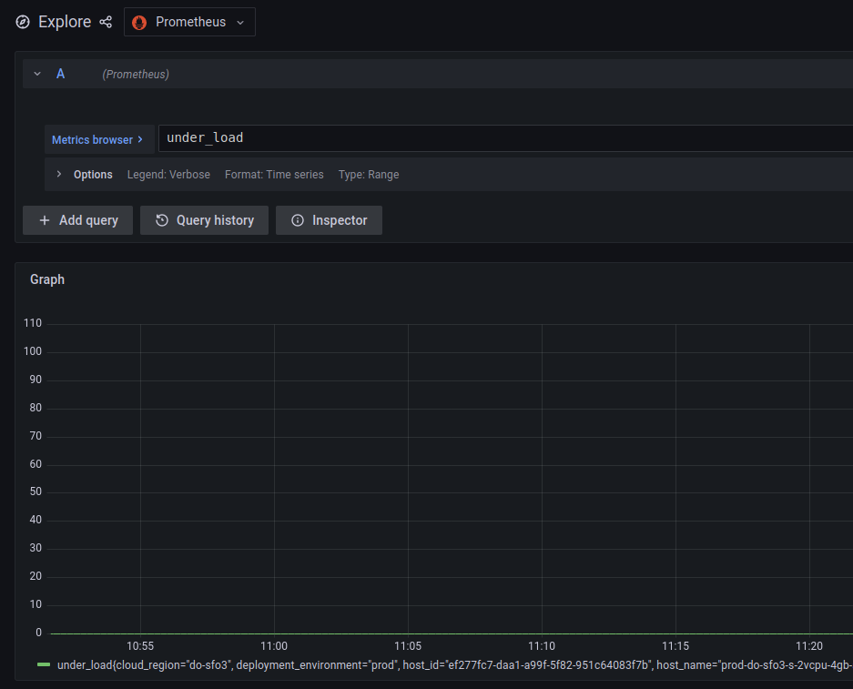
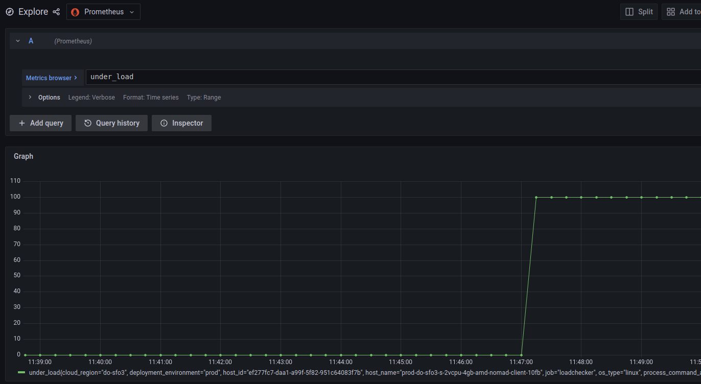

# Loadchecker

Generic service for performing load testing on. Used to test [nomad autoscaling
functionality](http://github.com/nomad/nomad-autoscaler)

## Usage

### Simulating Load

loadchecker emits an `under_load` metric to prometheus that can be configured
by the user using an http GET request.

By default, `under_load` will be 0

[src](https://grafana.prod.stratos.host:3000/goto/5KxdYg_7k?orgId=1)


; however, you can 'mock' the value to become whatever you specify

```shell
# NOTE: this IP:port will not be the same for you. You will need to look up the
# loadchecker IP:port for the specific allocation
curl http://100.83.35.47:20981/switch?val=100
```

[src](https://grafana.prod.stratos.host:3000/goto/bzypYg_7k?orgId=1)


You can then configure the autoscaler to use the `under_load` metric when
making autoscaling decisions (TODO).
